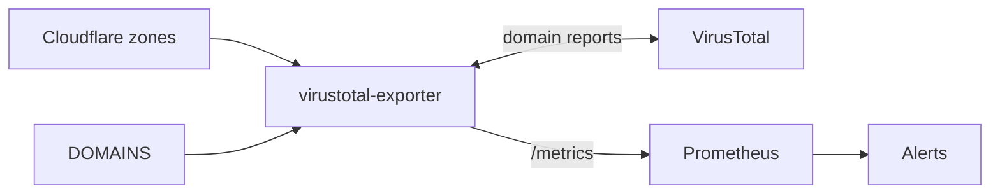

[](https://github.com/w3f/virustotal-exporter/actions/workflows/ci.yml)

# virustotal-exporter

virustotal-exporter watches a set of internet domains for adverse security reputation and publishes what it finds as Prometheus metrics. Every sweep it asks VirusTotal how many security vendors flag each domain as malicious or suspicious; the Helm chart ships alerting rules that turn a non-zero count, or a domain whose lookups keep failing, into an alert.

## Quick Start

**Prerequisites:** Node.js 22+

```bash
git clone https://github.com/w3f/virustotal-exporter.git
cd virustotal-exporter
npm ci
VIRUSTOTAL_API_KEY=... DOMAINS=example.com npm run dev
```

Metrics are served at `http://localhost:3000/metrics`.

## How It Works



The watched set is the union of every zone visible to the Cloudflare token and the `DOMAINS` list, rebuilt at the start of every sweep. Domains are looked up one at a time, 15 seconds apart, every `INTERVAL_MINUTES`; sweeps never overlap. A failed lookup publishes nothing for that domain in that sweep; a domain VirusTotal has never analysed publishes `0`.

## Metrics

| Metric                                      | Labels   | Meaning                                                |
| ------------------------------------------- | -------- | ------------------------------------------------------ |
| `virustotal_reports`                        | `domain` | vendors flagging the domain as malicious or suspicious |
| `virustotal_last_success_timestamp_seconds` | `domain` | Unix time of the last successful lookup                |

Served on port 3000 together with the default Node.js process metrics. `/health` answers 200 while the process is serving.

## Configuration

Environment variables only; logs are JSON lines on stdout.

| Variable               | Required | Default | Meaning                                               |
| ---------------------- | -------- | ------- | ----------------------------------------------------- |
| `VIRUSTOTAL_API_KEY`   | yes      |         | authenticates reputation lookups                      |
| `CLOUDFLARE_API_TOKEN` | no       |         | when set, every zone visible to it is watched         |
| `DOMAINS`              | no       | empty   | comma-separated domains to watch in addition to zones |
| `INTERVAL_MINUTES`     | no       | `480`   | minutes between sweep starts                          |
| `LOG_LEVEL`            | no       | `info`  | `debug`, `info`, `warn` or `error`                    |

See the [deployment guide](deployment/README.md) for the Docker image, the Helm chart and CI.

## Contributing

virustotal-exporter is built and maintained by the Web3 Foundation SecOps team for our own monitoring needs. See [CONTRIBUTING.md](CONTRIBUTING.md) for what that means for issues and pull requests, and [SECURITY.md](SECURITY.md) for reporting vulnerabilities privately.
